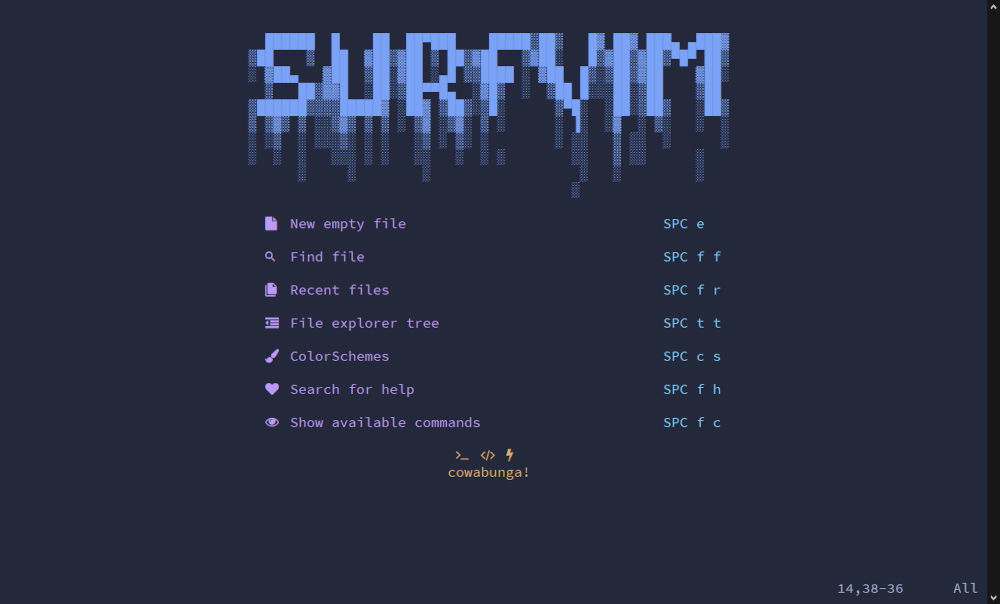

<!-- README.md for surfVim -->
<!-- TODO:
    - add install directions
    - add Table of contents if file gets too long
        - syntax: `1. [name](#headerName)`
-->
# surfVim


***surfVim***, is a personalized **Neovim** distribution built From Scratch. 
It contains a collection of remaps/keybinds, configs, and plugins 
to provide a complete and comfortable IDE experience.
All conveniently bundled together for EZ deployment.

made by: **gesteratops**

```lua
-- Showing off Some Example Lua Code: --
local text = "Written completely in Lua! " 
local text2 = "An exercise in learning the Lua coding language."

function helloWorld()
    io.write(text .. text2)
end

helloWorld()
```

Features added via plugins:
- [x] Improved Syntax Highlighting
- [x] Indent Style Auto Detection
- [x] Tab Completion 
- [x] Auto ({["'``'"]}) pair completion
- [ ] LSP Support
- [x] Fuzzy Finding for Files
- [x] File Explorer/Tree
- [x] File Bookmarks for specific folders
- [x] Popup Terminal
- [x] Popup Markdown Preview
- [x] Live Markdown Editing
- [x] Fancy Improved Statusline
- [x] Fancy Landing Page and Colorschemes
- [x] Tetris 

## Installation

coming soon..

## Screenshots:

coming soon..

## Requirements:
- [Neovim - as base text editor](https://github.com/neovim/neovim)
- [Packer - as plugin manager](https://github.com/wbthomason/packer.nvim)

## Usage Cheatsheet:

| Action | Modifier | Key combo |
| ------ | ----- | ----- |
| **Splits**
| vertical split | Spc | v s 
| horizontal split | Spc | h s 
| **Marks**
| set mark | m | any key 
| goto mark | ' | key selected 
| **Harpoons (project bookmarks)** 
| list bookmarks | Spc | h h 
| add bookmark | Spc | h t 
| goto bookmark 1 | Ctrl | u
| goto bookmark 2 | Ctrl | i
| goto bookmark 3 | Ctrl | o
| goto bookmark 4 | Ctrl | p
| **Window Focus** 
| switch focus down   | Ctrl | j
| switch focus up     | Ctrl | k
| switch focus left   | Ctrl | h
| switch focus right  | Ctrl | l
| **Tabs**
| new tab    | Ctrl | Home
| next tab   | Ctrl | PageDown
| prev tab   | Ctrl | PageUp
| close tab  | Ctrl | End
| **New File (from dashboard)**
| new empty file  | Spc | e
| **File Tree/Explorer**
| toggle tree  | Spc | t t 
| open tree    | Spc | t o
| close tree   | Spc | t q
| **Fuzzy Finder**
| fuzzy find files          | Spc | f f
| grep find word            | Spc | f g
| find recent files         | Spc | f r
| find/switch colorscheme   | Spc | c s 
| find help                 | Spc | f h
| find commands             | Spc | f c
| **Popup Terminal**
| open code runner  | Spc | r r
| **Popup Markdown Preview**
| open glow         | Spc | g g
| **Live Markdown Preview**
| open live preview    | Spc |m m
| toggle/open preview  | Spc |m o
| close preview        | Spc |m q

## References:
Project inspired by:

- [Spacevim](https://spacevim.org/), another 'vim distribution'
- [Lunarvim](https://github.com/LunarVim/LunarVim) another 'vim distribution', the creater documented the 'Neovim From Scratch' process here:
    - [youtube series](https://youtube.com/playlist?list=PLhoH5vyxr6Qq41NFL4GvhFp-WLd5xzIzZ)
    - [github page](https://github.com/LunarVim/Neovim-from-scratch)

<!-- README.md for surfVim: html comments work in markdown too wheeeee -->
